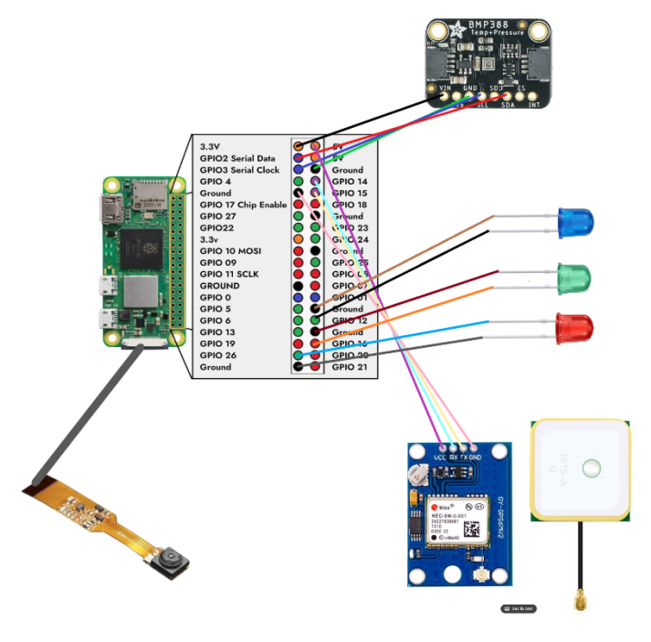

sudo nano /etc/systemd/system/start_both.service
[Unit]
Description=My Custom Startup Script
After=network.target

[Service]
Type=simple
ExecStart=/home/pi/myscript.sh
Restart=on-failure
User=pi
WorkingDirectory=/home/pi

[Install]
WantedBy=multi-user.target

sudo systemctl daemon-reload
sudo systemctl enable start_both.service
sudo systemctl start start_both.service
